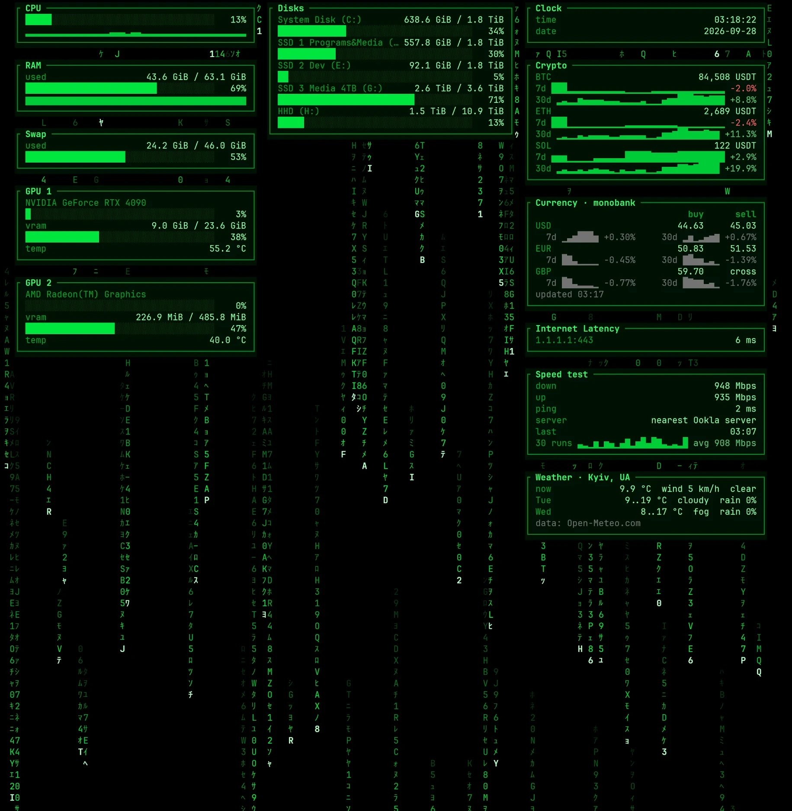

# telemetrix

**TermSaver**: a very light terminal screensaver and live system dashboard for
Windows 11 and Linux, written in Rust.

It shows CPU, memory, swap, disks and CPU temperature (where the computer
reports it), plus cards from small Lua plugins: exchange rates, crypto
prices, weather, an internet speed test, internet latency, a clock, uptime,
or anything you write yourself. It uses about 8 MB of memory without
plugins and about 12 MB with the seven default plugins, and almost no CPU
on the static theme. Settings live in a commented `telemetrix.toml` that a
wrong value can never break.

## What it looks like



The Matrix theme in Windows Terminal: system cards on the left and in the
middle, plugin cards on the right, digital rain behind them. Press `t` to
switch to the quiet `minimalist` theme or to the `tokyo-night`, `crt-amber`
and `cyberpunk` colour themes (see [Themes](#themes)).

## Install

**Download a release.** Open the
[Releases page](https://github.com/OliverD25/telemetrix/releases) and take
the file for your system:

- Windows: `telemetrix-<version>-windows-x86_64.zip`. Unpack it and start
  `telemetrix.exe` from Windows Terminal. Windows may warn that the program
  is from an unknown publisher, because it is not signed; choose "More info",
  then "Run anyway".
- Linux: `telemetrix-<version>-linux-x86_64.tar.gz`. Unpack it with
  `tar -xzf` and run `./telemetrix` in a terminal.

The program is one file. Copy it to any folder on your `PATH`.

**Or build it with Rust** (1.95 or newer; see
[Build from source](#build-from-source) for the C compiler it needs):

```
cargo install --git https://github.com/OliverD25/telemetrix
```

## Quick start

```
telemetrix                        # open the dashboard
telemetrix --exit-on-any-key      # screensaver mode: any key closes it
telemetrix snapshot               # print the numbers once, no dashboard
telemetrix screensaver install    # open it full screen when the PC is idle (Windows)
```

In the dashboard: `t` picks a theme, `s` opens the settings, `l` shows the
log, `?` lists all keys, `q` quits. Every change you make is saved at once.

## Where things live

| What | Windows | Linux |
|---|---|---|
| Settings file | `%APPDATA%\telemetrix\telemetrix.toml` | `~/.config/telemetrix/telemetrix.toml` |
| Plugins (`.lua` files) | `%APPDATA%\telemetrix\plugins` | `~/.config/telemetrix/plugins` |
| Plugin data (stored rates, results) | `%LOCALAPPDATA%\telemetrix\plugins` | `~/.local/share/telemetrix/plugins` |
| Screensaver watcher's copy of the program, and its log `watch.log` | `%LOCALAPPDATA%\telemetrix\screensaver` | (none) |

The settings file appears the first time you change something in the
dashboard; `telemetrix config init` writes it now, with a comment on every
key. `telemetrix config path` prints the path in use. The default plugins
are built into the program and are copied into the plugins folder on the
first start. See [Settings](#settings) and
[Where plugins live](#where-plugins-live) for the details.

## Build from source

You need Rust 1.95 or newer. On Windows you also need the Visual Studio C++
build tools, because the Lua interpreter is compiled from C source.

```
cargo build --release
```

The program is `target/release/telemetrix` (`telemetrix.exe` on Windows),
about 3.3 MB. It is all you need: the eight built-in plugins are part of
it, and it installs them on its first start (see
[Where plugins live](#where-plugins-live)). It works the same from any
folder.

```
telemetrix                        # the dashboard
telemetrix --theme minimalist     # start with the quiet theme
telemetrix --exit-on-any-key      # screensaver mode: any key quits
```

## Keys

| Key | What it does |
|---|---|
| `q`, `Esc`, `Ctrl+C` | quit (`Esc` closes an open box first) |
| `t` | open the theme box: `Up`/`Down` (or `t`/`T`) preview each theme live, `Enter` saves it, `Esc` goes back; `q` does not quit while the box is open |
| `s` | settings: every change is saved at once |
| `+` / `-` | more / fewer frames per second (saved) |
| `space` | pause the animation |
| `l` | log, with the program's own memory use at the top |
| `r` | look for new, changed and removed plugins now |
| `g` | run the speed test now (a plugin's own key) |
| `?` | help |

Inside the settings box: `Up`/`Down` move, `Enter` or `Right` pick the next
value, `Left` the previous one, `Shift` with `Left`/`Right` moves ten steps.
Paths are shown but can only be changed in the file.

Each plugin's section in the settings box also lists the plugin's own
settings, like the weather city or the main bank. On the weather city, `Enter`
opens a search list: type a few letters, pick the place with `Up`/`Down` and
`Enter`. On a text setting,
`Enter` opens an input line: type the text, `Enter` saves it and the plugin
runs at once, `Esc` cancels. While you type, every key goes to the input;
only `Ctrl+C` quits.

## Flags

| Flag | Meaning |
|---|---|
| `--config <path>` | use this settings file |
| `--theme <name>` | `minimalist`, `matrix`, `tokyo-night`, `crt-amber` or `cyberpunk` |
| `--fps <n>` | frames per second for animated themes, 1..60 |
| `--plugins-dir <dir>` | folder with `.lua` plugins |
| `--no-plugins` | run no plugins |
| `--exit-on-any-key` | screensaver mode: any key quits |
| `--log <path>` | also write the log to this file |
| `-h`, `--help` / `-V`, `--version` | help / version |

Flags never write to the settings file. If you change a value in the
dashboard that a flag set, your choice wins from then on.

## Commands without the dashboard

These need no terminal window, so scripts and agents can use them.

| Command | What it does |
|---|---|
| `telemetrix snapshot [--json] [--plugins]` | read the metrics once (and run every plugin once) and print them |
| `telemetrix config init [--force]` | write the default settings file with comments |
| `telemetrix config path` | print where the settings file is and whether it exists |
| `telemetrix config check [--json]` | list every problem in the settings file, with line numbers; exit 1 if there is one |
| `telemetrix config show` | print every setting, its value and where it came from (default, file or flag) |
| `telemetrix config reference` | print the settings table below |
| `telemetrix plugin check <file> [--json] [--run]` | run a plugin once and print its card, its settings and any error; exit 1 on error. `--run` acts like the plugin's key, so the speed test really runs |
| `telemetrix plugin check <file> --search <text> [--json]` | run the plugin's `search(text)` once and print the list the `s` box would show, for example the weather places for `lvov` |
| `telemetrix plugin list` | list the plugins that would run, the plugin home, and whether each one is built-in, built-in-edited or yours |
| `telemetrix plugin install [--force] [name...]` | install or update the built-in plugins now; `--force` also replaces your edits and restores deleted ones (all, or only the named ones) |
| `telemetrix themes` | list the theme names |
| `telemetrix screensaver install [--idle-minutes N] [--dry-run]` | open the dashboard full screen after N minutes without input (Windows); on Linux print the idle-daemon line. See [As a screensaver](#as-a-screensaver-when-the-pc-is-idle-windows) |
| `telemetrix screensaver uninstall [--dry-run]` / `status` | remove it / show whether it is installed and running |
| `telemetrix screensaver update [--dry-run]` | after `cargo install`: copy the new program to the watcher and restart it. See [Updating telemetrix](#updating-telemetrix) |
| `telemetrix selftest --memory [--seconds N] [--json]` | measure memory against the budgets; exit 1 if over (see below) |

## Themes

- **matrix** (the default): digital rain behind the cards, 15 frames per
  second. Density, speed and colour are in `[theme.matrix]`. On very large
  terminals (over 20 000 cells) it limits itself to 10 frames per second.
- **minimalist**: grey cards, colour only where a value is above its
  threshold.
- **tokyo-night**: the Tokyo Night colours: a dark slate background with
  quiet blues, purples and soft accents.
- **crt-amber**: an old amber monitor: amber on near-black, heavy card
  frames, and every second row a little darker, like scanlines.
- **cyberpunk**: a neon HUD: magenta titles in `[ brackets ]`, cyan frames
  and yellow values on a near-black background.

Every theme except matrix is static: it redraws only when data changes, so
it uses almost no CPU. Press `t` to try them with a live preview.

All themes lay the cards out in three columns on wide terminals, two on
medium ones and one on narrow ones. Below 40 by 10 cells the screen only says
"terminal too small". They show the same cards and rows; only the colours,
frames and background differ. The status bar and the boxes (`s`, `l`, `t`,
`?`) look the same in every theme.

### GPU card

Set `gpu.enabled = true`, or turn it on in the `s` box, to show one card per
GPU: the GPU's name, its load, the video memory used and total, and the
temperature. The temperature follows `units.temperature` and turns red
above `thresholds.temp_warn_c`. `gpu.interval_ms` sets how often the card
is read (every 2 seconds by default). With three columns the cards sit
under Swap; with two or one column they come after Disks. With two GPUs,
the one with more video memory is `GPU 1`.

`gpu.source` says where the numbers come from:

- `auto` (the default). On Windows, the counters Task Manager uses: the
  adapter statistics of the Windows display kernel (D3DKMT). Every GPU
  with a current driver answers, NVIDIA, AMD and Intel alike. The load is
  the busiest engine's share of the time, as in Task Manager's GPU column.
  The memory is the dedicated video memory. The temperature shows when the
  driver reports it. There is no power reading: Windows gives power only
  as a share of the card's limit, not in watts. On Linux, `auto` reads the
  files the amdgpu driver writes in `/sys/class/drm` (load, video memory,
  and the temperature of the card's sensor). NVIDIA's own driver does not
  write these files, so use `nvml` for an NVIDIA card on Linux.
- `nvml`: NVIDIA's NVML library, which comes with the NVIDIA driver
  (`nvml.dll` on Windows, `libnvidia-ml.so.1` on Linux). It also gives the
  power draw in watts, but it shows NVIDIA GPUs only.

The card needs no extra program. Without any readable GPU it stays hidden,
and the log (`l`) says why.

**Memory.** On the test PC (an RTX 4090 and an AMD Radeon iGPU) the
`auto` source adds about 1.3 MB of working set and 0.3 MB of private
memory (`selftest --memory`: 7.9 → 9.1 MB without plugins, 11.9 → 13.1 MB
with the 7 default plugins). Almost all of it is Windows' `gdi32.dll`,
which telemetrix loads only while the card is on; the readings themselves
cost next to nothing. That leaves little room under the 14 MB total
budget, so the card is still off by default. NVML is much larger: the
working set grows by about 24 MB when it starts, and it stays at that size
until the program ends. `telemetrix snapshot` always lists the GPUs from
`gpu.source`, because it ends right after.

Readings of both sources on the test PC, at rest, compared with Windows'
own performance counters (the ones Task Manager shows):

| RTX 4090 | `auto` (D3DKMT) | `nvml` | Windows counters |
|---|---|---|---|
| load | 0.0 – 0.2 % | 0 – 2 % | 0.08 % |
| video memory used | 7.60 GiB | 8.0 GiB | 7.50 GiB |
| video memory total | 23.6 GiB | 24.0 GiB | |
| temperature | 54.2 °C | 54 °C | |
| power | (none) | 49.3 W | |

NVML counts the memory the driver keeps for itself as used and as part of
the total; Windows leaves it out of both. The AMD iGPU (only `auto`
shows it) read 0 % load, 0.22 GiB of 0.47 GiB video memory and 39 – 40 °C.

### Disks and network drives

The Disks card shows each local drive with its label, as Explorer does:
"System Disk (C:)". Long names are cut with "…" so the numbers stay
visible.

Mapped network drives get their own Network card under Disks. On Windows
they are asked on a separate thread every `disks.network_interval_s`
seconds; a drive that does not answer within `disks.network_timeout_s` is
shown as `offline` in red, and a stuck drive never slows the rest of the
dashboard. Drives on the same server with the same size and free space
(several shares of one NAS volume) share one row, for example
`nas  M: P: R: W: X:`; set `disks.group_network = false` to list them
one by one. Explorer "network locations" without a drive letter are not
shown. `disks.hide` hides letters or mount points in both cards.

On Linux, mounts of type nfs, nfs4, cifs, smb3, smbfs, fuse.sshfs and 9p go
to the Network card. A hung network mount can still delay the disk
readings there; protecting against that is planned after v0.1.

**Roadmap:** the original brief lists eight more themes; three of them are
here (tokyo-night, crt-amber, cyberpunk). The other five are planned for
later versions.

## Where plugins live

Plugins are `.lua` files in one folder, the **plugin home**: the `plugins`
folder next to the settings file.

- Windows: `%APPDATA%\telemetrix\plugins`
- Linux: `~/.config/telemetrix/plugins` (or `$XDG_CONFIG_HOME/telemetrix/plugins`)
- Portable mode (a `telemetrix.toml` next to the program): the `plugins`
  folder next to that file.

telemetrix looks in this order: `--plugins-dir <dir>` (relative to the
current folder), then `general.plugins_dir` in the settings file (relative
to the settings file's folder; empty means the home), then the home. The
old default `plugins_dir = "plugins"` from v0.1 settings files means the
home too. The folder in use is written to the log (`l`) on every rescan,
and an empty Plugins card shows it.

**Built-in plugins.** The eight built-in plugins are part of the program (seven run by default; Hosts is off until you set it up).
On every start, telemetrix copies them into the home and remembers what it
wrote in `.bundled.json` there:

- a built-in plugin that was never installed is installed;
- one you have not changed is updated when a new telemetrix brings a new
  version;
- one you changed is never touched; the log says so once per start and
  names the command that would replace it;
- one you deleted stays deleted.

Files that are not built in are never touched.

**To change a built-in plugin,** edit its file in the home. telemetrix
keeps your version from then on. To go back to the built-in version, run
`telemetrix plugin install --force weather`. To restore a plugin you
deleted, run the same command with its name. **To add your own plugin,**
put a new `.lua` file into the home and press `r`; see
[PLUGINS.md](PLUGINS.md).

**For development,** start telemetrix from the repository with
`--plugins-dir plugins`. It then reads the plugins from the repository
folder, so a change to `plugins/weather.lua` shows after `r`.

## Plugins and where their data comes from

telemetrix comes with eight plugins. None needs an account or a key. The
network plugins stay far below the free limits of their services. When a
service does not answer, a card keeps its last values and marks them
stale. Rates, prices, the weather place and speed results are kept in a
small file per plugin (`%LOCALAPPDATA%\telemetrix\plugins` on Windows,
`~/.local/share/telemetrix/plugins` on Linux, or `--data-dir <dir>`), so
cards are not empty after a restart.

| Plugin | Shows | Data source | Free limit | How often telemetrix asks |
|---|---|---|---|---|
| Currency | USD, EUR, GBP to hryvnia from one bank (the other as backup), 7- and 30-day graphs | Monobank `api.monobank.ua/bank/currency`; PrivatBank card rate `api.privatbank.ua/p24api/pubinfo`; NBU official rate `bank.gov.ua/NBU_Exchange` | Monobank: 1 request per 5 minutes; the answer is cached on their side. PrivatBank and NBU publish no limit. | Monobank and PrivatBank every 5 minutes (Monobank never sooner, even after a restart). NBU history once a day, one request per currency. |
| Crypto | BTC, ETH, SOL in USDT, 7- and 30-day graphs | Binance `api.binance.com/api/v3/ticker/price` and `/klines` | A request weight of 6000 per minute per IP address (Binance's `exchangeInfo`, checked 2026-09-26). An address that keeps asking after HTTP 429 is banned for 2 minutes up to 3 days (HTTP 418). After a 429 the plugin stops asking until the next interval. After a 418 it waits as long as Binance's `Retry-After` header says, or else 10 minutes, doubled for every 418 in a row up to 24 hours; the card keeps its stored prices and shows a red line `paused by Binance until 14:32`. | Prices every minute (one request). Daily history once an hour, one request per coin. |
| Weather | now, tomorrow and the day after | Open-Meteo `api.open-meteo.com` and its geocoding service | Free for non-commercial use: 600 requests a minute, 5,000 an hour, 10,000 a day (open-meteo.com/en/terms, checked 2026-09-26). The data is licensed CC BY 4.0, which requires attribution. | Every 10 minutes. A search in the `s` box sends at most 6 requests and keeps answers for 10 minutes; a city typed in the file is looked up once per change. |
| Speed test | download, upload, ping, server | the nearest Ookla speed-test server; Cloudflare `speed.cloudflare.com` as the backup | No published limit. | Every 30 minutes, and when you press `g`. Never at start. The server list once a day. |
| Internet latency | time to connect to 1.1.1.1:443 | a TCP connection, no service | none | every 30 seconds |
| Clock, Uptime | time and date; computer name and uptime | this computer | none | every second; every 30 seconds |
| Hosts (off by default) | health, load, memory, disk, uptime and UPS of your own servers | commands you list in `[commands]`, for example `ssh` | none | every 5 minutes, and when you press `h` |

Weather data by Open-Meteo.com (CC BY 4.0). The weather card says so in its
last line, `data: Open-Meteo.com`.

**The speed test uses a lot of data.** It runs for a fixed time, not a
fixed size: 3 seconds per direction over 2 connections. So each test moves
about (download speed + upload speed) × 3 seconds. On a 935/933 Mbps line
that is about 700 MB per test, and at the 30-minute interval about 34 GB a
day, or about 1 TB a month. On a metered connection, raise the interval,
lower `streams` or `seconds` in the `s` box, or set `enabled = false` under
`[plugin.speedtest]`.

**Where the speed test measures.** It asks Ookla's public server list
(`www.speedtest.net/api/js/servers`) for the five nearest servers, pings
each and uses the fastest one for 24 hours. This is the same list the
open-source speedtest-cli uses. It is not an official API, so it may change
without notice; that is why Cloudflare is the automatic backup. When the
backup is used, the card says `Cloudflare (backup)` and the log says why.
Cloudflare's servers can be farther away, so its numbers are often lower.

Settings you can change in the `s` box:

- **Currency:** the primary bank, `mono` or `privat`. The card shows that
  bank's buy and sell rates in a table, with one grey line of 7-day and
  30-day graphs (of the official NBU rate) under each currency. The other
  bank is only a backup: the card switches to it when the primary bank
  fails and has no rates from the last hour, and the title then says
  `(backup)`. Rates from a failed bank that are less than an hour old stay
  on the card with a red `stale since 14:32 (HTTP 429)` line. Monobank has
  no buy/sell rate for GBP, so the card shows its cross rate; PrivatBank
  has no GBP at all, so the card shows the NBU rate. On a card narrower
  than about 40 characters the 30-day graph is left out. The list of
  currencies (`currencies = ["USD", "EUR", "GBP"]`) is set in the file.
  The v0.2 keys `compact` and `show_month` are no longer used.
- **Crypto:** the quote currency (default `USDT`). The coins
  (`coins = ["BTC", "ETH", "SOL"]`) are set in the file.
- **Weather:** the city and the preferred country. `Enter` on the city
  row opens a search list: type a few letters, even misspelled, an old
  Russian name like `kiev` or `lvov`, or Cyrillic; pick the place with
  `Up`/`Down` and `Enter`. That saves `city`, `lat`, `lon` and `place`, so
  the card shows exactly that place. Places in `country` (default `UA`;
  empty = any country) come first in the list, then the biggest. A city
  typed by hand in the file still works. The coordinates alone (with
  `label` as the card title) are used only when no city is set: settings
  files from v0.1 have `lat`, `lon` and `label` but no city, so they keep
  showing the same place. Without a city and without coordinates the card
  shows Kyiv. The log says which one is used, and `config check` warns
  when a file has a city and coordinates but no picked place. Temperatures
  follow `units.temperature` (°C or °F); changing it redraws the card at
  once.
- **Speed test:** `server` (empty = the nearest Ookla server, `host:port`
  forces one, `cloudflare` uses Cloudflare only), `streams` (parallel
  connections, 1..8) and `seconds` per direction (2..10). The old keys
  `download_mb`, `upload_mb` and `max_seconds` are ignored.

- **Hosts:** set in the file only. List your servers under
  `[plugin.hosts]` and the commands that read them under `[commands]`,
  then set `enabled = true`. telemetrix runs only the commands you list
  there, by name, never through a shell. See the hosts notes in
  [PLUGINS.md](PLUGINS.md#the-default-plugins) and the commented example
  in `telemetrix.example.toml`.

To write your own plugin, see [PLUGINS.md](PLUGINS.md).

## Settings

The settings file is found in this order:

1. `--config <path>`
2. the environment variable `TELEMETRIX_CONFIG`
3. `telemetrix.toml` next to the program
4. Windows: `%APPDATA%\telemetrix\telemetrix.toml`;
   Linux: `$XDG_CONFIG_HOME/telemetrix/telemetrix.toml` or
   `~/.config/telemetrix/telemetrix.toml`

Without a file the defaults are used. The first change you make in the
dashboard creates the file, with a comment on every key.
`telemetrix.example.toml` in this repository is the same file.

A bad settings file never stops the program:

- A missing key uses its default.
- An unknown key is ignored, with a warning in the log.
- A wrong value (wrong type or out of range) uses the default for that key
  only, with a warning.
- A syntax error keeps the last good settings and shows a red line at the
  top of the screen with the line number.
- The running dashboard picks up a saved change within 2 seconds.

Each plugin can have its own `[plugin.<name>]` section; see
[PLUGINS.md](PLUGINS.md).

### Settings reference

This table is printed by `telemetrix config reference`. A test fails when it
no longer matches the program.

<!-- reference:start -->
| Key | Default | Allowed values | In the `s` overlay | Meaning |
|---|---|---|---|---|
| `schema` | `1` | 1..1 | no, edit the file | format version of this file, do not change |
| `general.theme` | `"matrix"` | minimalist \| matrix \| tokyo-night \| crt-amber \| cyberpunk | yes | minimalist \| matrix \| tokyo-night \| crt-amber \| cyberpunk |
| `general.fps` | `15` | 1..60 | yes | frames per second for animated themes, 1..60 |
| `general.exit_on_any_key` | `false` | true \| false | yes | true = screensaver mode: any key quits |
| `general.plugins_dir` | `""` | a file or folder path | no, edit the file | empty = the plugins folder next to this file; relative paths start there |
| `general.log_file` | `""` | a file or folder path | no, edit the file | "" = off, otherwise a file path |
| `general.log_lines` | `200` | 50..2000 | yes | lines kept for the l overlay, 50..2000 |
| `units.temperature` | `"celsius"` | celsius \| fahrenheit | yes | celsius \| fahrenheit |
| `units.bytes` | `"binary"` | binary \| decimal | yes | binary = GiB, decimal = GB |
| `metrics.cpu_interval_ms` | `1000` | 200..60000 | yes | 200..60000 |
| `metrics.memory_interval_ms` | `1000` | 200..60000 | yes | 200..60000 |
| `metrics.temps_interval_ms` | `5000` | 1000..60000 | yes | 1000..60000 |
| `metrics.disks_interval_ms` | `30000` | 1000..600000 | yes | 1000..600000 |
| `metrics.history_len` | `240` | 10..3600 | yes | samples kept for sparklines, 10..3600 |
| `thresholds.cpu_warn_pct` | `80` | 1..100 | yes | highlight CPU above this, 1..100 |
| `thresholds.temp_warn_c` | `75` | 1..150 | yes | highlight temperature above this |
| `thresholds.disk_warn_pct` | `90` | 1..100 | yes | highlight disks fuller than this |
| `gpu.enabled` | `false` | true \| false | yes | GPU card: load, video memory, temperature; about 1.3 MB more memory, so off by default |
| `gpu.interval_ms` | `2000` | 500..60000 | yes | 500..60000 |
| `gpu.source` | `"auto"` | auto \| nvml | yes | auto = the system's counters (Windows: as Task Manager; Linux: amdgpu files); nvml = NVIDIA's library, about 24 MB more |
| `disks.show_network` | `true` | true \| false | yes | show mapped network drives in their own card |
| `disks.network_interval_s` | `60` | 10..3600 | yes | how often network drives are asked, 10..3600 |
| `disks.network_timeout_s` | `5` | 1..30 | yes | a drive that takes longer is shown offline, 1..30 |
| `disks.group_network` | `true` | true \| false | yes | one row for drives on the same server and volume |
| `disks.hide` | `[]` | list of texts | no, edit the file | letters or mount points to hide, like ["X:", "/boot"] |
| `plugins.enabled` | `true` | true \| false | yes | false = run no plugins at all |
| `plugins.default_interval_s` | `60` | 5..86400 | yes | used when a plugin sets no interval, 5..86400 |
| `plugins.http_timeout_s` | `10` | 1..60 | yes | per request, 1..60 |
| `plugins.call_timeout_s` | `5` | 1..60 | yes | Lua time limit per update(), 1..60 |
| `plugins.memory_limit_mb` | `8` | 1..64 | yes | per plugin, 1..64 |
| `plugins.rescan_interval_s` | `60` | 0..86400 | yes | 0 = rescan only on the r key |
| `plugins.max_plugins` | `16` | 1..64 | yes | at most this many plugins run, 1..64 |
| `memory.budget_mb` | `14` | 5..1024 | yes | whole program, above it the status bar turns amber |
| `memory.plugin_budget_mb` | `1` | 1..64 | yes | Lua memory per plugin, above it one log warning |
| `theme.matrix.density` | `0.5` | 0.0..1.0 | yes | 0.0..1.0 |
| `theme.matrix.speed` | `1.0` | 0.1..5.0 | yes | 0.1..5.0 |
| `theme.matrix.color` | `"green"` | green \| amber \| cyan \| white \| #rrggbb | yes | green \| amber \| cyan \| white \| #rrggbb |
| `theme.minimalist.show_sparklines` | `true` | true \| false | yes | history graphs under CPU and RAM |

## Memory and CPU

Keeping telemetrix small is a main goal. There are two budgets:

- **Core** (the dashboard without plugins): under **10 MB** working set. This
  limit is fixed.
- **Total** (the default setup, Matrix and the seven plugins): under
  `memory.budget_mb`, **14 MB** by default. Each plugin gets an allowance of
  about 1 MB (`memory.plugin_budget_mb` for its Lua memory).

The dashboard reads its own memory every 5 seconds. The status bar shows it
("self 7.4 MB") and turns amber above the budget. The log (`l`) shows the
peak, the private bytes and each plugin's Lua memory. Going over a budget
only writes a warning to the log; nothing is stopped. The warning and the
amber colour pause while a speed test runs and for 10 seconds after it,
because a test briefly needs a few MB for its connections; the status bar
then shows `(speed test)` next to the number. The separate Lua limit
(`plugins.memory_limit_mb`) still stops a runaway plugin.

### Measured numbers

Windows 11, release build, 32-core PC, legacy console, 20 seconds after the
start. Working set is what Task Manager shows as memory; private bytes is the
memory that belongs to this program alone.

| Setup | Working set | Private bytes |
|---|---|---|
| no plugins, minimalist | 7.3 MB | 1.9 MB |
| no plugins, matrix | 7.3 MB | 2.0 MB |
| 2 offline plugins (clock, uptime) | 7.9 MB | 2.4 MB |
| 1 network plugin (weather) | 10.0 MB | 2.5 MB |
| 5 plugins, minimalist | 11.0 MB | 3.4 MB |
| 5 plugins, matrix (v0.1 default) | 11.0 MB | 3.3 MB |
| 7 plugins, matrix (v0.2 default, `selftest --memory`, 30 s) | 12.5 MB | 4.5 MB |
| no plugins, GPU card on (`auto`, RTX 4090 + iGPU, `selftest --memory`, 30 s) | 9.1 MB | 2.4 MB |
| 7 plugins, GPU card on (`auto`, RTX 4090 + iGPU, `selftest --memory`, 30 s) | 13.0 MB | 4.0 MB |
| no plugins, GPU card on (NVML, RTX 4090, `selftest --memory`, 30 s) | 31.1 MB | 21.9 MB |
| 7 plugins, GPU card on (NVML, RTX 4090, `selftest --memory`, 30 s) | 35.5 MB | 23.6 MB |

For comparison, a Rust program that does nothing but sleep uses 4.9 MB
working set on the same PC. Much of that comes from Windows itself and from
other software that loads into every process (for example an antivirus).

CPU, measured over 60 seconds, as a share of one core:

| Setup | CPU |
|---|---|
| minimalist, no plugins | 0.18 % |
| matrix at 15 fps, 5 plugins | 1.45 % |

The first network request loads the TLS code, about 2 MB. That is why one
network plugin costs more than two offline ones.

What keeps it small on Windows:

- CPU usage comes from `GetSystemTimes`, not from Windows performance
  counters (PDH), which cost about 4 MB.
- Temperature sensors are read through WMI, which costs about 3.7 MB, and
  most Windows PCs report none. A short helper process asks first, and the
  dashboard loads WMI only if it will get a value.
- DLLs that are rarely needed are loaded on first use, not at start.
- All plugins share one HTTP client, which is dropped after a minute without
  requests.
- The program uses the Windows **segment heap**, chosen in its embedded
  manifest (`telemetrix.manifest`). With the default heap, private memory
  crept up by about 1 MB an hour with the default plugins, although the
  memory in use stayed flat: the heap kept freed space committed and never
  gave it back. The segment heap gives it back, so private memory stays
  flat over hours, and the total is about 0.5 MB lower. The dashboard
  without plugins measures the same with either heap.

### Before every release: `selftest --memory`

```
telemetrix selftest --memory
```

It starts the real dashboard twice in a hidden console: once with the default
settings and all plugins, then once with `--no-plugins`. After 30 seconds
(`--seconds N` to change) each run reports its peak and final working set.
The command prints both against their budgets and exits with code 1 if
either is over. Network plugins run for real; if the network is down they
fail, which is fine for this test.

```
memory selftest: 30 s per run, one run after the other, hidden consoles
            final      peak   private  budget  result
total     11.7 MB   12.2 MB    3.7 MB   14 MB  ok  (7 plugins)
core       7.8 MB    7.8 MB    2.1 MB   10 MB  ok  (0 plugins)
```

Run it before every release. Agents should run it after any change to the
code or the plugins.

### Memory growth over time: `selftest --memory --soak <minutes>`

```
telemetrix selftest --memory --soak 60
```

A short run cannot show a slow leak. The soak runs one hidden dashboard
with the default plugins (without the speed test, whose test would hide
everything else) for 10 minutes of warm-up plus the given minutes. The
dashboard notes its private bytes (memory that belongs to this program
alone) once a minute. After the warm-up, the command takes the median of
the slopes between all pairs of those numbers, which ignores the single
jumps of about 0.2 MB when a plugin fetches something, and fails with exit
code 1 when private memory grows faster than 0.2 MB per hour. It also fails when the peak is over the
budget. `--json` prints every minute's number.

For a deeper look, build with `cargo build --release --features
alloc-stats`. That build counts the bytes the program holds on its heap,
Lua included, and writes a `heap:` line to the log every minute. Heap bytes
that climb mean a leak in the program; flat heap bytes under rising private
bytes mean the memory is held outside the program's own allocations.

## Linux

telemetrix builds and runs the same way on Linux. You need Rust 1.95 or newer
and a C compiler (gcc or clang) for the Lua interpreter.

```
cargo install --path .
```

This puts `telemetrix` in `~/.cargo/bin`. Nothing else needs copying: the
default plugins are built in and go to `~/.config/telemetrix/plugins` on
the first start.

- **Settings file:** `~/.config/telemetrix/telemetrix.toml`, or
  `$XDG_CONFIG_HOME/telemetrix/telemetrix.toml` when that variable is set.
- **Start it automatically:** see the swayidle and xautolock recipes under
  "Starting it automatically".
- **Disks:** system and package mounts are not shown: snap images (`/snap`),
  and on WSL its own mounts (`/usr/lib/wsl`, `/usr/lib/modules`,
  `/mnt/wslg`, `/mnt/wsl`, `/init`). On WSL, the Windows drives at
  `/mnt/c`, `/mnt/d` and so on are local disks of the host and appear as
  "C: (/mnt/c)".
- **Network drives:** nfs, nfs4, cifs, smb3, smbfs, fuse.sshfs and 9p mounts
  go to the Network card. A hung network mount can still delay the disk
  readings in v0.1.
- **CPU temperature:** read from hwmon. telemetrix prefers the Intel
  package sensor (`coretemp`, "Package id 0"), then the AMD control
  temperature (`k10temp`, "Tctl"), then any other CPU sensor. WSL and most
  virtual machines have no sensors; the line is then hidden.
- **Containers:** sysinfo takes cgroup limits into account, so inside a
  container the total RAM can be the container's limit, not the machine's.
- **Signals:** SIGTERM, SIGHUP (the terminal was closed) and SIGINT end the
  dashboard cleanly and restore the terminal. If the terminal is already
  gone, the program still exits within about a second.
- **`selftest --memory`** needs the `script` command from util-linux (part
  of every common distribution); it gives each run a pseudo-terminal.

Measured in WSL 2 with `selftest --memory` (Ubuntu 24.04, release build,
30 seconds after the start, peak resident memory; Linux has no cheap
"private bytes" figure):

| Setup | Resident memory |
|---|---|
| no plugins | 4.4 MB |
| 7 plugins, matrix (default) | 6.6 MB |

These are WSL numbers: Linux shares library pages differently from Windows,
so they are not comparable with the Windows table above.

## Guide for agents

- **Change the settings file safely.** Write the new content to a temporary
  file next to it, then rename it over `telemetrix.toml`. The dashboard reads
  the file at any moment and must never see half of it.
- **Check the settings after every change:** `telemetrix config check`.
  Exit code 0 means no problems; otherwise it lists each one with its line.
  `--json` gives the same list for a program.
- **Check a plugin after every change:** `telemetrix plugin check <file>`.
  Exit code 0 means the card works. See [PLUGINS.md](PLUGINS.md).
- **Read the numbers without a terminal:** `telemetrix snapshot --json
  --plugins`.
- **Keep memory in budget:** run `telemetrix selftest --memory` after a
  change. Exit code 1 means a budget is broken.

## Starting it automatically

### Windows Terminal profile

Add a profile to Windows Terminal's `settings.json` (Settings, then "Open
JSON file"), in the `profiles.list` array:

```json
{
    "name": "telemetrix",
    "commandline": "%USERPROFILE%\\.cargo\\bin\\telemetrix.exe",
    "closeOnExit": "always"
}
```

The path assumes you installed it with `cargo install --path .`. Start it
full screen with:

```
wt.exe -F -p telemetrix
```

### A keyboard shortcut on the desktop

1. Right-click the desktop, then New, then Shortcut.
2. As the location, enter `wt.exe -F -p telemetrix`.
3. Open the shortcut's Properties and click into "Shortcut key".
4. Press the keys you want, for example `Ctrl+Alt+T`.

Windows only honours such keys for shortcuts on the desktop or in the Start
menu.

### As a screensaver when the PC is idle (Windows)

```
telemetrix screensaver install --idle-minutes 10
```

After 10 minutes without a key press or mouse move, the dashboard opens
full screen in Windows Terminal, in screensaver mode: any key closes it.
It uses the Windows Terminal profile `telemetrix` when you have one (see
above) and the default profile otherwise. Without Windows Terminal it opens
in a normal console window.

- `telemetrix screensaver install --dry-run` prints exactly what would be
  created and changes nothing.
- `telemetrix screensaver status` shows whether it is installed, whether
  the watcher and a screensaver dashboard run, the last lines of the
  watcher's log, and how long the PC has been idle.
- `install` and `update` start the watcher and check 5 seconds later that
  it still runs. If it does not, they say so, show the last lines of its
  log (`watch.log` next to the copy) and end with exit code 1. They also
  refuse to go on while another watcher runs that does not end when
  asked. Only one watcher can run at a time: a second one ends at once and
  writes `another screensaver watcher is already running; this one ends`
  to the log.
- Run `install` and `update` from a normal terminal. A packaged app (the
  Claude desktop app, for example) and the programs it starts see
  `%LOCALAPPDATA%` through a redirection, so the copy really lands in the
  app's own folder under `%LOCALAPPDATA%\Packages`. telemetrix then
  registers that real folder, because Task Scheduler cannot see the
  redirected path; `install` says so with a `note:` line. It works, but the
  copy disappears if that app is removed or reset, and `status` then says
  `copy: missing`. Running `update` from a normal terminal moves it back.
- `telemetrix screensaver uninstall` removes it, ends the watcher and
  deletes the watcher's copy of the program (`--dry-run` works here too).
- `telemetrix screensaver update` copies a new telemetrix to the watcher
  after an update. See [Updating telemetrix](#updating-telemetrix).

**How it works.** `install` creates a Task Scheduler task named
"telemetrix screensaver" that starts a small watcher,
`telemetrix screensaver watch`, at every logon, and starts it once right
away. The task runs as you, only while you are logged on, and needs no
administrator rights. The watcher has no window. Every 5 seconds it asks
Windows how long ago the last input came (`GetLastInputInfo`). When that
passes the limit, it opens the dashboard once; it opens it again only
after you have used the PC in between. It does not open a second dashboard
while one it started still runs, and it waits while a program (a video
player, for example) asks Windows to keep the display on. The watcher
uses about 0.7 MB of working set and 1.4 MB of private memory
(measured on Windows 11 after 60 seconds) and almost no CPU.

Why not Task Scheduler's own idle trigger? Windows counts the PC as idle
only when the CPU and disks are quiet too, and checks that only every few
minutes, so the start comes late or never. The logon trigger that starts
the watcher is reliable.

The watcher runs from a copy of the program,
`%LOCALAPPDATA%\telemetrix\screensaver\telemetrix-watch.exe`. Windows
cannot replace a program file while it runs. If the watcher ran your
`telemetrix.exe` itself, `cargo install` could not update that file. The
copy still opens the dashboard from the `telemetrix.exe` you ran `install`
with; `install` writes down its path. If you move telemetrix somewhere
else, run `install` again. If you ran `install` with `--config <file>`, the
dashboard uses that file.

### Updating telemetrix

1. Close every telemetrix dashboard. A running dashboard locks
   `telemetrix.exe`, so the update would fail with "Access is denied".
2. Install the new version, for example
   `cargo install --git https://github.com/OliverD25/telemetrix`.
3. If you use the screensaver, run `telemetrix screensaver update`. It
   ends the watcher, copies the new program to it and starts it again.
   `telemetrix screensaver status` says `copy: older than ...` when you
   forgot this step.

A screensaver installed by a build without `screensaver update` runs
`telemetrix.exe` itself and blocks step 2. Run
`telemetrix screensaver uninstall` with that build first, then update,
then run `telemetrix screensaver install` again. A newer build's
`telemetrix screensaver update` also changes such an older task to use the
copy, with the same settings.

An older version of this README suggested a task with `/SC ONIDLE` and the
same name. `install` replaces it, and `uninstall` removes it.

On Linux, `telemetrix screensaver install` writes nothing; it prints the
swayidle and xautolock lines below with the right path.

### Linux: swayidle (Sway, Wayland)

In your Sway config, start it after 5 minutes without input:

```
exec swayidle -w timeout 300 'foot telemetrix --exit-on-any-key'
```

Use your own terminal instead of `foot` if you like.

### Linux: xautolock (X11)

```
xautolock -time 5 -locker "xterm -fullscreen -e telemetrix --exit-on-any-key" &
```

## Questions and bugs

Please open an issue: https://github.com/OliverD25/telemetrix/issues. Say which
system you use (Windows or Linux), the telemetrix version (`telemetrix --version`),
and what you saw. For a plugin problem, add the output of
`telemetrix plugin check <file> --run`.

## License

Either [MIT](LICENSE-MIT) or [Apache-2.0](LICENSE-APACHE), at your option.
